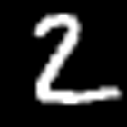
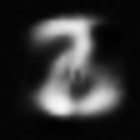
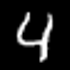
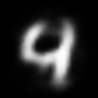
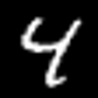
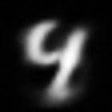
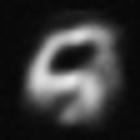

# Simple implementation of Restricted Boltzmann Machine (RBM)

A tiny, educational implementation of a Restricted Boltzmann Machine (RBM).

## Features

* Implemented with NumPy only.
* Optional GPU acceleration: seamlessly switches to CuPy when available (--use-gpu in examples).
* Clean, readable code intended for learning and small experiments.

## Install

There are two typical ways to install this package, depending on your use case:

### Quick trial (local editable install)

If you just want to try it out locally, run:

```sh
git clone https://github.com/watanabe-appi/simple_rbm.git
cd simple_rbm
python3 -m venv .venv
source .venv/bin/activate
python -m pip install --upgrade pip
python -m pip install -e .
```

This will install the package in editable mode, so changes you make in the source directory are immediately reflected when you import and run the code.

### Use in your own project repository

If you want to use this package in your own project, first make sure your project directory is the current working directory, then set up a virtual environment there and install:


```sh
# in your own project repository
python3 -m venv .venv
source .venv/bin/activate
python -m pip install --upgrade pip
python3 -m pip install https://github.com/watanabe-appi/simple_rbm.git
```

This will install the package directly from GitHub into the virtual environment associated with your project.
Keeping each project in its own virtual environment is recommended to avoid dependency conflicts.

### GPU Acceleration (Optional, via CuPy)

If you have CUDA and want GPU acceleration:
* CUDA 11.2: python -m pip install cupy-cuda112
* CUDA 11.8: python -m pip install cupy-cuda118
* CUDA 12.x: python -m pip install cupy-cuda12x

Then run examples with `--use-gpu`.

## Quickstart: MNIST Example

### Clone this respository

```sh
git clone https://github.com/watanabe-appi/simple_rbm.git
cd simple_rbm
python3 -m venv .venv
source .venv/bin/activate
python -m pip install --upgrade pip
python3 -m pip install https://github.com/watanabe-appi/simple_rbm.git
python3 -m pip install tensorflow Pillow
```

[!NOTE]

On macOS, Python **3.11** is required to use TensorFlow.

```sh
python3.11 -m venv .venv
source .venv/bin/activate
python3 -m pip install --upgrade pip
python3 -m pip install https://github.com/watanabe-appi/simple_rbm.git
python3 -m pip install tensorflow Pillow
```

### Running the Example

To train an RBM on the MNIST dataset, run:

```sh
cd examples
python3 train_mnist.py
```

Or, you can use GPGPU if CuPy is installed.

```sh
cd examples
python3 train_mnist.py --use-gpu
```

The script  will:

* Train an RBM model using the MNIST dataset.
* Save the trained model parameters in Pickle format as `rbm_mnist.pkl`.
* Save the training loss for each epoch to `loss.dat`.

To test reconstruction with the trained model, run:

```sh
python3 reconstruct_mnist.py
```

This script will:

* Load the trained model parameters from `rbm_mnist.pkl`.
* Take the first 10 MNIST digit images as input to the RBM.
* Save the input images as `input0.png` to `input9.png`.
* Save the reconstructed images as `output0.png` to `output9.png`.


### Example Output

When running train_mnist.py, you will see output similar to:

```sh
$ python3 train_mnist.py
# Computation will proceed on the CPU.
Epoch [1/10], KL Divergence: 0.3689
Epoch [2/10], KL Divergence: 0.2504
Epoch [3/10], KL Divergence: 0.2144
Epoch [4/10], KL Divergence: 0.1982
Epoch [5/10], KL Divergence: 0.1875
Epoch [6/10], KL Divergence: 0.1797
Epoch [7/10], KL Divergence: 0.1736
Epoch [8/10], KL Divergence: 0.1685
Epoch [9/10], KL Divergence: 0.1645
Epoch [10/10], KL Divergence: 0.1612
Loss history saved to loss.dat
```

When running reconstruct_mnist.py, you will see output like:

```sh
$ python3 reconstruct_mnist.py
input_0.png -> RBM -> output_0.png
input_1.png -> RBM -> output_1.png
input_2.png -> RBM -> output_2.png
input_3.png -> RBM -> output_3.png
input_4.png -> RBM -> output_4.png
input_5.png -> RBM -> output_5.png
input_6.png -> RBM -> output_6.png
input_7.png -> RBM -> output_7.png
input_8.png -> RBM -> output_8.png
input_9.png -> RBM -> output_9.png
```

After training and reconstruction, the scripts produce pairs of images named `input*.png` and `output*.png`:
* `input_*.png`: the original MNIST digit images used as input to the RBM.  
* `output_*.png`: the reconstructed images produced by the trained RBM.  

Below is an example of the output:

| Input                           | Output                            |
| ------------------------------- | --------------------------------- |
|  |  |
|  |  |
|  |  |
|  |  |
|  |  |
|  |  |
|  |  |
|  |  |
|  |  |
|  |  |

### Running on ISSP System C (University of Tokyo)

Setup.

```sh
module purge
module load cuda/11.2
git clone git@github.com:watanabe-appi/simple_rbm.git 
cd simple_rbm
python3 -m venv .venv 
source .venv/bin/activate
python3 -m pip install --upgrade pip
python3 -m pip install tensorflow Pillow pickles
python3 -m pip install cupy-cuda112
python3 -m pip install git+ssh://git@github.com/watanabe-appi/simple_rbm.git
```

Run on an ACC node

```sh
qsub -I -q i1accs -l select=1:ncpus=64
module purge
module load cuda/11.2
source .venv/bin/activate
cd examples
python3 mnist.py --use-gpu
```

## Implementation Details

* **Model type:** This RBM is a *Bernoulli–Bernoulli* model, where both the visible and hidden units are binary and take values of 0 or 1.  

* **Training algorithm:** The training is performed using *Contrastive Divergence with one Gibbs step (CD-1)*, which is a widely used and efficient method for RBM learning.  

* **Loss function:** The training progress is monitored using the *Kullback–Leibler (KL) divergence* between the input data and its reconstruction.  

## License

MIT

## Acknowledgement

If you use this code in academic work, a simple citation in the text (or a software reference in your appendix) would be greatly appreciated.
